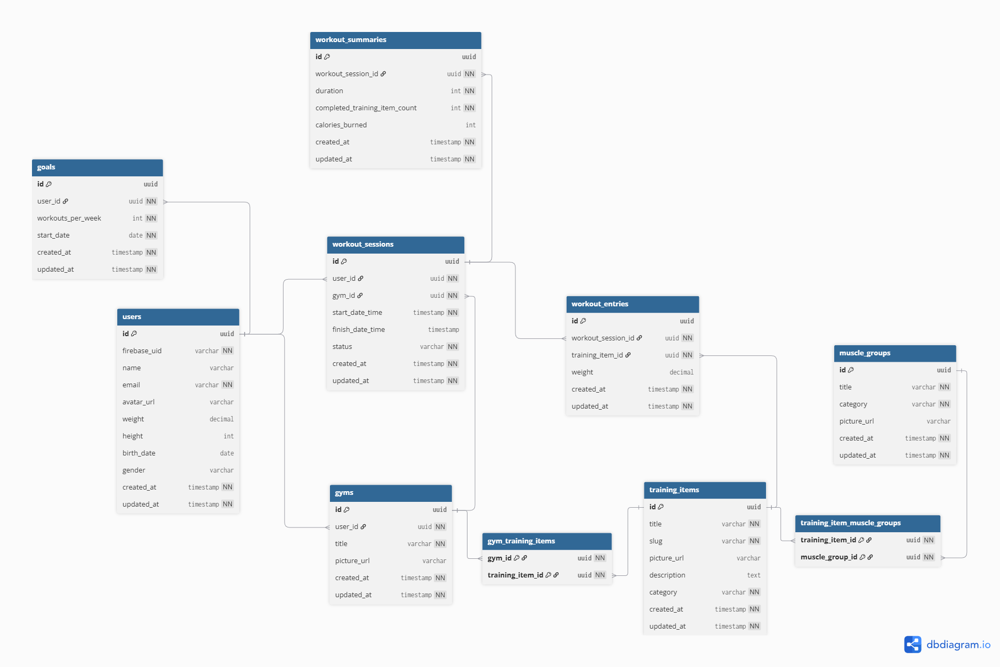

# Data Model

This document describes the relational data model of the FunkyTap backend.

The database is designed using a normalized relational schema.  
All relationships are expressed through foreign keys and junction tables for many-to-many associations.

## Entity Relationship Diagram

## Tables

### users
Stores user profiles.

### gyms
Belongs to `users` via `user_id`.

### training_items
Shared catalog of machines and exercises.

### muscle_groups
Catalog used to categorize training items.

### gym_training_items
Junction table between `gyms` and `training_items`.

### training_item_muscle_groups
Junction table between `training_items` and `muscle_groups`.

### workout_sessions
Belongs to `users` and `gyms`.

### workout_entries
Belongs to `workout_sessions` and `training_items`.

### workout_summaries
One-to-one with `workout_sessions`.

### goals
Belongs to `users`

## Relationship Summary

- users → gyms (1:N)
- users → goals (1:N)
- users → workout_sessions (1:N)
- gyms ↔ training_items (M:N via gym_training_items)
- training_items ↔ muscle_groups (M:N via training_item_muscle_groups)
- gyms → workout_sessions (1:N)
- workout_sessions → workout_entries (1:N)
- workout_sessions → workout_summaries (1:0..1)
- training_items → workout_entries (1:N)