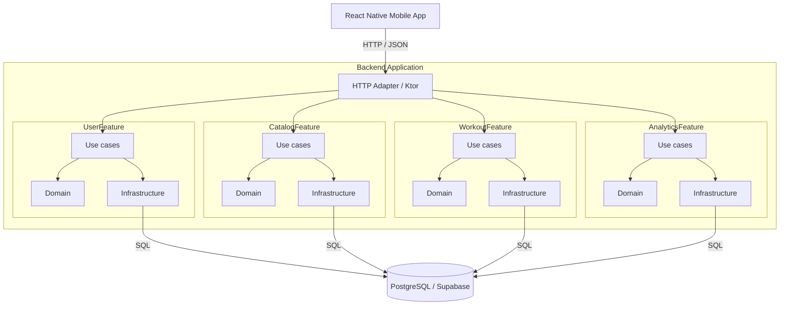

# Backend Component Diagram

```mermaid
flowchart TB
    mobile[React Native Mobile App]

    subgraph backend[Backend Application]
        ktor[HTTP Adapter / Ktor]

        subgraph userFeature[UserFeature]
            userDomain[Domain]
            userUseCases[Use cases]
            userInfra[Infrastructure]
        end

        subgraph catalogFeature[CatalogFeature]
            catalogDomain[Domain]
            catalogUseCases[Use cases]
            catalogInfra[Infrastructure]
        end

        subgraph workoutFeature[WorkoutFeature]
            workoutDomain[Domain]
            workoutUseCases[Use cases]
            workoutInfra[Infrastructure]
        end

        subgraph analyticsFeature[AnalyticsFeature]
            analyticsDomain[Domain]
            analyticsUseCases[Use cases]
            analyticsInfra[Infrastructure]
        end
    end

    db[(PostgreSQL / Supabase)]

    mobile -->|HTTP / JSON| ktor

    ktor --> userUseCases
    ktor --> catalogUseCases
    ktor --> workoutUseCases
    ktor --> analyticsUseCases

    userUseCases --> userDomain
    catalogUseCases --> catalogDomain
    workoutUseCases --> workoutDomain
    analyticsUseCases --> analyticsDomain

    userUseCases --> userInfra
    catalogUseCases --> catalogInfra
    workoutUseCases --> workoutInfra
    analyticsUseCases --> analyticsInfra

    userInfra -->|SQL| db
    catalogInfra -->|SQL| db
    workoutInfra -->|SQL| db
    analyticsInfra -->|SQL| db
```