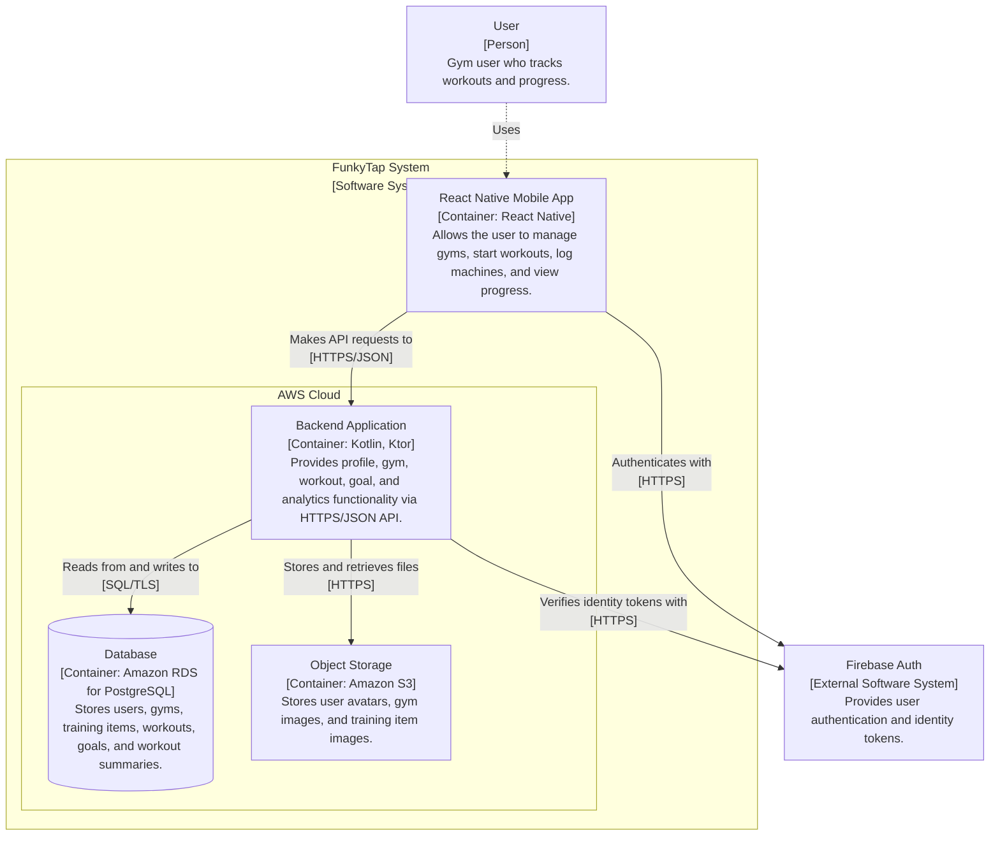

# Container Diagram

```mermaid
flowchart TB
    user["User<br/>[Person]<br/>Gym user who tracks workouts and progress."]

    subgraph system["FunkyTap System<br/>[Software System]"]
        mobile["React Native Mobile App<br/>[Container: React Native]<br/>Allows the user to manage gyms, start workouts, log machines, and view progress."]

        subgraph aws["AWS Cloud"]
            backend["Backend Application<br/>[Container: Kotlin, Ktor]<br/>Provides profile, gym, workout, goal, and analytics functionality via HTTPS/JSON API."]

            db[("Database<br/>[Container: Amazon RDS for PostgreSQL]<br/>Stores users, gyms, training items, workouts, goals, and workout summaries.")]

            storage["Object Storage<br/>[Container: Amazon S3]<br/>Stores user avatars, gym images, and training item images."]
        end
    end

    firebase["Firebase Auth<br/>[External Software System]<br/>Provides user authentication and identity tokens."]

    user -.->|"Uses"| mobile

    mobile -->|"Authenticates with<br/>[HTTPS]"| firebase
    mobile -->|"Makes API requests to<br/>[HTTPS/JSON]"| backend

    backend -->|"Verifies identity tokens with<br/>[HTTPS]"| firebase
    backend -->|"Reads from and writes to<br/>[SQL/TLS]"| db
    backend -->|"Stores and retrieves files<br/>[HTTPS]"| storage
```