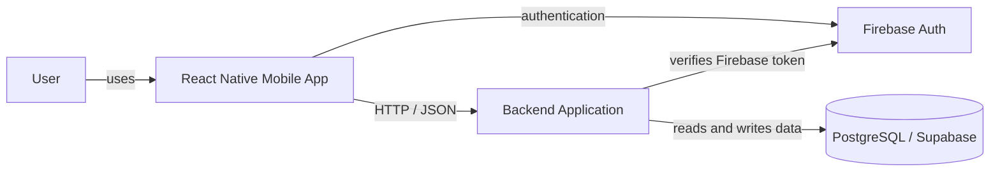

# Container Diagram

```mermaid
flowchart LR
    user[User]

    mobile[React Native Mobile App]

    backend[Backend Application]

    auth[Firebase Auth]

    db[(PostgreSQL / Supabase)]

    user -->|uses| mobile
    mobile -->|HTTP / JSON| backend
    mobile -->|authentication| auth
    backend -->|verifies Firebase token| auth
    backend -->|reads and writes data| db
```