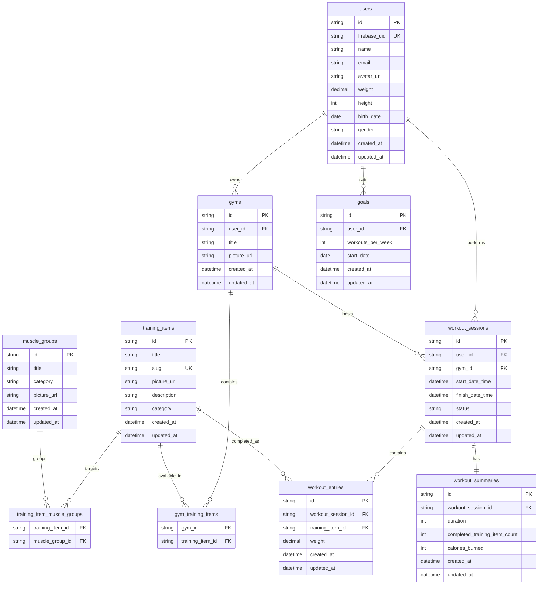

```mermaid
erDiagram
    users {
        string id PK
        string firebase_uid UK
        string name
        string email
        string avatar_url
        decimal weight
        int height
        date birth_date
        string gender
        datetime created_at
        datetime updated_at
    }

    gyms {
        string id PK
        string user_id FK
        string title
        string picture_url
        datetime created_at
        datetime updated_at
    }

    training_items {
        string id PK
        string title
        string slug UK
        string picture_url
        string description
        string category
        datetime created_at
        datetime updated_at
    }

    muscle_groups {
        string id PK
        string title
        string category
        string picture_url
        datetime created_at
        datetime updated_at
    }

    gym_training_items {
        string gym_id FK
        string training_item_id FK
    }

    training_item_muscle_groups {
        string training_item_id FK
        string muscle_group_id FK
    }

    workout_sessions {
        string id PK
        string user_id FK
        string gym_id FK
        datetime start_date_time
        datetime finish_date_time
        string status
        datetime created_at
        datetime updated_at
    }

    workout_entries {
        string id PK
        string workout_session_id FK
        string training_item_id FK
        decimal weight
        datetime created_at
        datetime updated_at
    }

    workout_summaries {
        string id PK
        string workout_session_id FK
        int duration
        int completed_training_item_count
        int calories_burned
        datetime created_at
        datetime updated_at
    }

    goals {
        string id PK
        string user_id FK
        int workouts_per_week
        date start_date
        datetime created_at
        datetime updated_at
    }

    users ||--o{ gyms : owns
    users ||--o{ workout_sessions : performs
    users ||--o{ goals : sets

    gyms ||--o{ workout_sessions : hosts
    gyms ||--o{ gym_training_items : contains
    training_items ||--o{ gym_training_items : available_in

    training_items ||--o{ training_item_muscle_groups : targets
    muscle_groups ||--o{ training_item_muscle_groups : groups

    workout_sessions ||--o{ workout_entries : contains
    training_items ||--o{ workout_entries : completed_as

    workout_sessions ||--|| workout_summaries : has
```